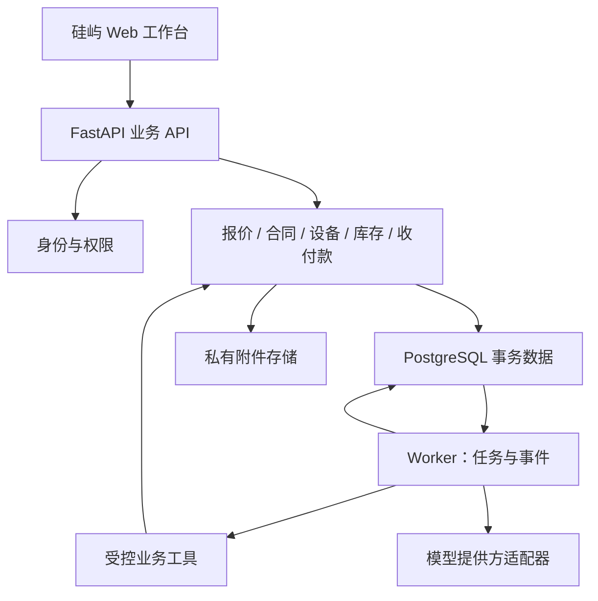

# 生产架构与目录边界

状态：TASK-000 建议基线，等待独立复核；不代表功能已实现。

来源：[启动指南](../reference/SILICON_Codex_Architecture_and_Kickoff.md)。以下保留对应原文规则；本次具体决策见 [ADR](adr/ADR-001.md)。

本地为空仓库，采纳 Vite 建议，不存在 Next.js 迁移冲突。具体依赖版本与支持状态交 TASK-001 实测锁定，本任务不声称已核验当前兼容组合。

## 4. 推荐技术框架

### 核心决策

采用 **React + TypeScript + Vite 前端、FastAPI 模块化单体、PostgreSQL、独立 Worker、对象存储**。

选择 Vite 是因为现有 Demo 是内部业务台，首期没有明确 SEO 或 SSR 需求，并且需要将原生界面逐页组件化。若你实际接入的目标仓库已经是 Next.js，应保留该仓库框架并写 ADR，不为技术统一再次搬家。后端采用 Python，便于与后续文档解析和模型能力集成。

FastAPI 官方也提供 React/PostgreSQL/Docker 的全栈参考，但只借鉴基础设施，不用它的默认 UI 替换硅屿界面：[官方模板](https://fastapi.tiangolo.com/project-generation/)。

| 层 | 首版选择 | 设计约束 |
|---|---|---|
| Web | React、TypeScript、Vite、原有 CSS token | React Router 管路由；TanStack Query 管服务端数据；仅在确有需要时引入全局客户端 store |
| 表单与 API | React Hook Form + Zod；OpenAPI 生成 TypeScript 客户端 | 前端校验服务体验，后端校验决定是否接受 |
| 图与地图 | 现有 SVG 服务器图；经营图表优先 Apache ECharts | 图表只展示 API 指标；地图数据源、版本、许可与坐标系可追踪 |
| API | FastAPI、Pydantic、SQLAlchemy 2、Alembic | 业务按模块组织，同库事务；固定兼容版本和 lockfile |
| 数据 | PostgreSQL | 外键、唯一约束、RLS、防重和并发控制；测试也使用 PostgreSQL |
| 异步 | 同一后端包中的独立 Worker + PostgreSQL jobs/outbox | 开始不依赖 Redis；至少一次投递，副作用必须幂等 |
| 附件 | S3 兼容对象存储 + attachment 元数据 | 私有访问、短期下载地址、hash、版本、上传隔离 |
| 身份 | OIDC 身份提供方适配器 | 首先支持一个真实 IdP；本地可用 Keycloak 开发配置；不自研生产密码体系 |
| 测试 | pytest、Vitest、Playwright | 领域规则、真实数据库集成、关键业务 E2E、视觉回归 |
| 运行 | Docker Compose 起步，反向代理同域路由 | Web、API、Worker 分进程；生产数据库和文件有异机备份 |

这是一组建议，不是要求把所有依赖在第一天装齐。TASK-001 记录实际版本、维护状态与兼容组合；沿用已存在的包管理器，不跟随未经验证的 latest。



模型只生成结构化候选结果或解释，Worker 决定调用哪个受控工具；图中的模型节点没有数据库凭据。所有 UI、批处理和 Agent 调用共享同一领域命令。

### 仓库结构

使用一个生产 monorepo，避免前后端、schema 与任务书版本错位。原 Demo 仓库保持独立参考，不直接覆写原站。

```text
apps/web/                         React 业务前端
apps/api/src/silicon/
  modules/identity/
  modules/crm/
  modules/catalog/
  modules/quoting/
  modules/contracts/
  modules/procurement/
  modules/inventory/
  modules/assembly/
  modules/delivery/
  modules/service/
  modules/finance_ops/
  modules/insights/
  modules/agents/
  shared/                         事务、权限、错误、审计等有限公共能力
apps/api/migrations/
apps/api/tests/
apps/worker/                      入口；复用 API 包的服务层
packages/api-client/             从 OpenAPI 生成，不手改
packages/ui/                     复用的硅屿 UI 组件与 token
tests/e2e/
tests/fixtures/
infra/                           开发与生产示例配置
docs/product/
docs/architecture/adr/
docs/design/
docs/tasks/
docs/reviews/
docs/runbooks/
runtime/project.json             相对路径；不存个人电脑路径或密钥
AGENTS.md
README.md
```

模块内部采用 router → application service → domain rules → repository。模块不能跨目录直接改别人的 ORM 实体；跨模块写入由应用服务协调同一个事务。不要为了“整洁”把每个 CRUD 切成微服务。

### 运行与部署边界

开发可使用 Compose；业务生产 API/Worker 运行在支持 Python 容器的服务器或云容器平台上。原 Sites Demo 的托管配置不能直接运行这套 Python 后端，不复用其部署身份。若将 Sites 保留为展示入口，只连接专用演示数据环境。

默认同域：`/` 到 Web，`/api/v1` 到 API。身份登录采用授权码流程、服务端会话与 HttpOnly/Secure Cookie；有状态写请求实现 CSRF 防护，不把长期令牌放 localStorage。配置租户允许域、上传上限和明确的 CORS 白名单。

Worker 使用任务租约、心跳、超时回收、最大尝试次数、退避和 failed 队列。任务领取可用 `FOR UPDATE SKIP LOCKED`，但它是队列消费机制，不应用于库存正确性查询。[PostgreSQL SELECT 文档](https://www.postgresql.org/docs/current/sql-select.html)

当跨系统流程需要数日持久等待、复杂补偿与可靠恢复时，再评估 Temporal；首期以数据库状态机和任务表足够。[Temporal 官方说明](https://docs.temporal.io/evaluate/understanding-temporal)
