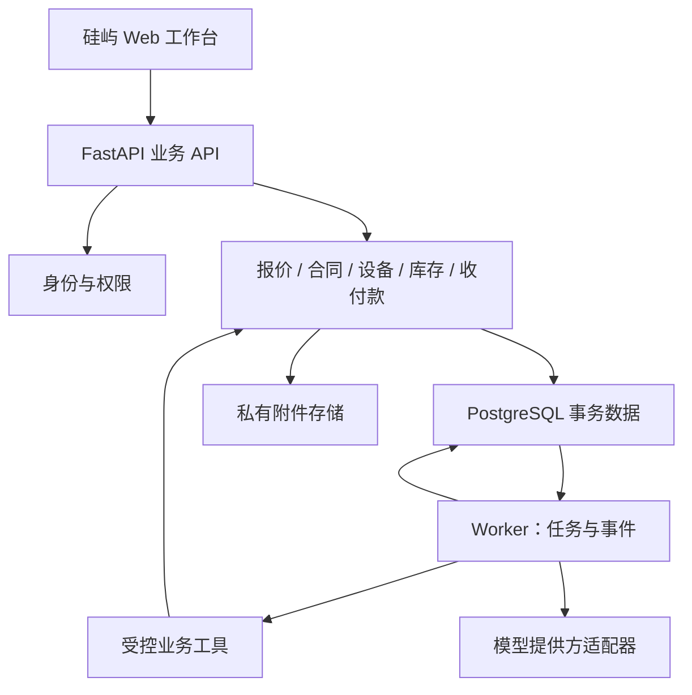

# 硅屿 SILICON：产品技术架构与 Codex 开工指南

版本：0.1 · 2026-09-09 · 状态：架构建议与可执行任务基线，尚未完成生产实现。

本指南以 AI 服务器销售、组装、交付与售后的小型企业为首个客户群。目标是让现有两套 Demo 成为可持续交付的产品，而不是重做一套视觉不同的通用 ERP。文中的规模、性能与运维指标均为建议验收目标，不是已测结果或客户已确认要求。

## 1. 怎样合作

推荐四个职责，先用三条工作流即可，不需要先开发一个多 Agent 调度平台。

| 角色 | 负责 | 输出与权限边界 |
|---|---|---|
| 你：业务决策人、最终验收人 | 客户访谈、真实业务规则、商业优先级、发布范围 | 确认关键业务口径、体验及上线；不必审批每次可逆代码修改 |
| 本对话：产品负责人、架构师 | 需求拆解、数据模型、架构决策、任务书、复核审查 | 依据仓库证据给结论；没有 diff 和测试证据时不宣称审查通过 |
| Codex 执行线程 | 实现、测试、修复、迁移、文档和 Git 维护 | 按任务允许范围工作，提交可复现的证据包 |
| 独立 Review 线程 | 在相同 commit 上检查实现与业务不变量 | 先给发现与复现方法，不边审边大改；实现者负责修复 |

Review 可以仍用 Codex，但必须另开上下文，对照任务书和真实 diff，而不是只阅读执行者的总结。本对话负责产品与架构层的最终复核。不同上下文可减少遗漏，不能替代测试和人工业务验收。

流程：任务 ready → executing → review_ready → passed / changes_requested → accepted。另有 blocked 和 cancelled；blocked 必须包含具体阻塞证据、可继续部分、恢复条件。每次只推进一个具备完整验收条件的任务。

第一阶段只需要“产品架构对话 + 一个 Codex 执行线程 + 一个独立 Review 线程”。以后只有两个任务的数据契约、文件归属和依赖清楚时才并行，并使用独立 worktree；数据库迁移和集成分支由同一执行者协调。

## 2. 已核实的 Demo 基线

本次已读取已发布内容、取得现有项目源码并检查主要 HTML/CSS/JavaScript；没有执行浏览器视觉回归或完整端到端测试。以下是源码事实，不是根据截图猜测。

| 项目 | 已发布版本 | 源码提交 | 页面 |
|---|---|---|---|
| 服务器配置报价 | v1 | `65e465092f0afc5519ed1a60214697fbf6a2f2a5` | https://silicon-server-studio.huiquan003.chatgpt.site |
| 业务工作空间 | v4 | `09e204ec99a74a821f35d6799b9e6e00c0c8393d` | https://silicon-contract-studio.huiquan003.chatgpt.site |

报价项目身份：`appgprj_6a9e678b54f48191af4637dae884188f`。
业务工作空间项目身份：`appgprj_6a9f6c67e8dc8191a7dd9c3aca8604c1`。
它们是两个独立项目，不要混写身份、部署配置或远程仓库。

当前会话源码参考目录分别为 `/workspace/sites/silicon-quote-reference` 和 `/workspace/sites/silicon-workspace-reference`。这些路径仅属于当前运行环境，不能当作你电脑上的路径写进项目规范。后续 Codex 若没有相同 Sites 能力，应使用你提供的源码 checkout/源码包；不要把网页文本当成完整源码，也不要假定公开 URL 无需登录。

源码结构：

- 报价：`dist/index.html`、`dist/style.css`、`dist/app.js`。
- 工作空间：上述文件，加 `dist/analytics.js`、`dist/operations.js`、`dist/business.js`、`dist/land.js`。
- 两者均有 `.openai/hosting.json`，没有 React 项目结构。这里的 `dist/` 是已跟踪的原生源码，不可按惯例删除为“构建产物”。
- 报价中的服务器是 SVG 可交互等距部件示意图，支持部件选择、展开、数量和报价联动；不需要先引入 WebGL 重做。
- 工作空间已有合同、设备、客户分布、采购、库存、周转、报价利润、交付、售后和续保扩容。
- 当前存在全局数组、页面内存状态、后续脚本包装 `render` 的实现方式；刷新会恢复演示数据。
- 演示版 `operations.js` 固定了示例税换算参数 `1.13`，`business.js` 有成本与费用估算；这些只能作为测试样例，不能直接成为真实会计规则。
- 现有客户列表从合同数组派生；生产模型必须允许一个客户关联多个合同、多个项目和多个装机地点。
- 现有交付示例把开票接在验收后；生产模型必须将开票、物流、验收与收款分成独立状态。

### 应保留的设计语言

| 元素 | 已有值或特征 | 工程化方式 |
|---|---|---|
| 页面背景 | `#f5f7f8` | `--color-background` |
| 主要文字 | `#202e2d` | `--color-text` |
| 工作空间主按钮 | `#254f3d` | `--color-primary` |
| 主要深色指标卡 | `#244d3e` | `--color-feature-surface` |
| 浅绿选中区域 | `#eaf3ed` / `#edf3ef` | 选中与轻背景分别建 token |
| 面板边框 | `#e0e7e2` | `--color-border` |
| 字体 | Inter、PingFang SC、Microsoft YaHei、sans-serif | 保留中英层级；字体不可用时稳定降级 |
| 圆角 | 按钮 8px、面板约 13–18px | 建立有限的 radius 尺度 |
| 页面组织 | 留白、浅色面板、少量深绿强调、细边框、中英小标题 | 以现有布局为基线，不套默认后台模板 |

令牌来自源码初查，不意味着所有页面已经完成一致性或对比度验证。迁移时保留风格，同时修复文字可读性、键盘焦点、窄屏表格和弹窗访问性问题。

新项目拆出 `WorkspaceShell`、`PageHeading`、`MetricCard`、`ActionCard`、`ContractDetail`、`DeviceDrawer`、`ServerDiagram`、`QuoteSummary`、`ActivityTimeline` 等组件。先保持 CSS 几何和 DOM 意图，再逐页接 API。不要混用原生 DOM 改写和 React 对同一个 DOM 子树的管理。

## 3. 产品边界与商业化结构

产品定位：面向设备销售与交付服务公司的经营工作台，以项目、报价和设备档案串起商业动作。

首个行业包是 AI 服务器；通用层抽取客户、供应商、项目、单据、库存、收付款、权限与任务。行业层负责服务器配置约束、BOM、SN 装配关系、压力测试、保修和返厂。不在首版实现插件市场、任意工作流设计器或全功能总账。

建议提供三种商业包装，价格须由首批客户访谈和交付成本验证：

| 包装 | 功能组成 | 工程要求 |
|---|---|---|
| 基础订阅 | 客户、配置报价、合同、设备档案 | 企业级 entitlement，按团队规模配置席位上限 |
| 经营版 | 采购、库存、项目成本、回款、交付售后 | 同一代码库启用模块，禁止为每个客户复制一套核心 |
| 行业实施与 Agent 加购 | 数据导入、单据模板、受控 AI 草稿、专用部署 | 实施一次性收费 + 运维续费；Agent 配额与成本台账 |

先实现人工开通套餐与计量；在线支付、订阅扣款和按使用量结算后置。套餐限制必须在 API 生效，不能只隐藏菜单；欠费时保留受权限控制的读取和导出能力，避免把客户数据锁死。

第一版本支持一个企业租户内一套主要经营主体、多个仓库；租户与法人主体分开建模，集团合并、关联交易、多币种结算后置。金额字段从第一天记录币种，首批上线只启用 CNY。

## 4. 推荐技术框架

### 核心决策

采用 **React + TypeScript + Vite 前端、FastAPI 模块化单体、PostgreSQL、独立 Worker、对象存储**。

选择 Vite 是因为现有 Demo 是内部业务台，首期没有明确 SEO 或 SSR 需求，并且需要将原生界面逐页组件化。若你实际接入的目标仓库已经是 Next.js，应保留该仓库框架并写 ADR，不为技术统一再次搬家。后端采用 Python，便于与后续文档解析和模型能力集成。

FastAPI 官方也提供 React/PostgreSQL/Docker 的全栈参考，但只借鉴基础设施，不用它的默认 UI 替换硅屿界面：[官方模板](https://fastapi.tiangolo.com/project-generation/)。

| 层 | 首版选择 | 设计约束 |
|---|---|---|
| Web | React、TypeScript、Vite、原有 CSS token | React Router 管路由；TanStack Query 管服务端数据；仅在确有需要时引入全局客户端 store |
| 表单与 API | React Hook Form + Zod；OpenAPI 生成 TypeScript 客户端 | 前端校验服务体验，后端校验决定是否接受 |
| 图与地图 | 现有 SVG 服务器图；经营图表优先 Apache ECharts | 图表只展示 API 指标；地图数据源、版本、许可与坐标系可追踪 |
| API | FastAPI、Pydantic、SQLAlchemy 2、Alembic | 业务按模块组织，同库事务；固定兼容版本和 lockfile |
| 数据 | PostgreSQL | 外键、唯一约束、RLS、防重和并发控制；测试也使用 PostgreSQL |
| 异步 | 同一后端包中的独立 Worker + PostgreSQL jobs/outbox | 开始不依赖 Redis；至少一次投递，副作用必须幂等 |
| 附件 | S3 兼容对象存储 + attachment 元数据 | 私有访问、短期下载地址、hash、版本、上传隔离 |
| 身份 | OIDC 身份提供方适配器 | 首先支持一个真实 IdP；本地可用 Keycloak 开发配置；不自研生产密码体系 |
| 测试 | pytest、Vitest、Playwright | 领域规则、真实数据库集成、关键业务 E2E、视觉回归 |
| 运行 | Docker Compose 起步，反向代理同域路由 | Web、API、Worker 分进程；生产数据库和文件有异机备份 |

这是一组建议，不是要求把所有依赖在第一天装齐。TASK-001 记录实际版本、维护状态与兼容组合；沿用已存在的包管理器，不跟随未经验证的 latest。



模型只生成结构化候选结果或解释，Worker 决定调用哪个受控工具；图中的模型节点没有数据库凭据。所有 UI、批处理和 Agent 调用共享同一领域命令。

### 仓库结构

使用一个生产 monorepo，避免前后端、schema 与任务书版本错位。原 Demo 仓库保持独立参考，不直接覆写原站。

```text
apps/web/                         React 业务前端
apps/api/src/silicon/
  modules/identity/
  modules/crm/
  modules/catalog/
  modules/quoting/
  modules/contracts/
  modules/procurement/
  modules/inventory/
  modules/assembly/
  modules/delivery/
  modules/service/
  modules/finance_ops/
  modules/insights/
  modules/agents/
  shared/                         事务、权限、错误、审计等有限公共能力
apps/api/migrations/
apps/api/tests/
apps/worker/                      入口；复用 API 包的服务层
packages/api-client/             从 OpenAPI 生成，不手改
packages/ui/                     复用的硅屿 UI 组件与 token
tests/e2e/
tests/fixtures/
infra/                           开发与生产示例配置
docs/product/
docs/architecture/adr/
docs/design/
docs/tasks/
docs/reviews/
docs/runbooks/
runtime/project.json             相对路径；不存个人电脑路径或密钥
AGENTS.md
README.md
```

模块内部采用 router → application service → domain rules → repository。模块不能跨目录直接改别人的 ORM 实体；跨模块写入由应用服务协调同一个事务。不要为了“整洁”把每个 CRUD 切成微服务。

### 运行与部署边界

开发可使用 Compose；业务生产 API/Worker 运行在支持 Python 容器的服务器或云容器平台上。原 Sites Demo 的托管配置不能直接运行这套 Python 后端，不复用其部署身份。若将 Sites 保留为展示入口，只连接专用演示数据环境。

默认同域：`/` 到 Web，`/api/v1` 到 API。身份登录采用授权码流程、服务端会话与 HttpOnly/Secure Cookie；有状态写请求实现 CSRF 防护，不把长期令牌放 localStorage。配置租户允许域、上传上限和明确的 CORS 白名单。

Worker 使用任务租约、心跳、超时回收、最大尝试次数、退避和 failed 队列。任务领取可用 `FOR UPDATE SKIP LOCKED`，但它是队列消费机制，不应用于库存正确性查询。[PostgreSQL SELECT 文档](https://www.postgresql.org/docs/current/sql-select.html)

当跨系统流程需要数日持久等待、复杂补偿与可靠恢复时，再评估 Temporal；首期以数据库状态机和任务表足够。[Temporal 官方说明](https://docs.temporal.io/evaluate/understanding-temporal)

## 5. 领域模型：先定义业务事实，再定义页面

| 模块 | 核心实体 | 必须表达的关系 |
|---|---|---|
| 企业与权限 | tenant、legal_entity、user、membership、role、permission、entitlement | 用户可加入多个租户；每次请求只在一个已授权租户操作 |
| 客户与项目 | organization、contact、contact_role、project、customer_site、opportunity | 一个客户多个项目；甲方项目负责人和关键人分别关联，可多人且有历史 |
| 内部人员 | employee_assignment | 项目销售负责人、售后负责人、协作人分开，人员离职保留历史责任 |
| 商品目录 | sku、manufacturer、brand、platform、sku_spec、price_book、price_entry | 自有/第三方品牌是销售品牌属性；制造商、供应商、品牌不可混为一个字段 |
| 配置报价 | configuration、bom_version、bom_line、compatibility_rule_set、quote、quote_version、quote_line、discount_policy | 选配清单、规则版本、价格版本、汇总、折扣和预计成本形成不可变发布快照 |
| 合同与订单 | contract、contract_version、contract_party_snapshot、sales_order、sales_order_line、payment_milestone | 签约信息冻结；报价只生成合同草稿；合同与交付订单分开 |
| 采购 | purchase_contract、purchase_order、purchase_order_line、goods_receipt、supplier_invoice | 采购合同可对应多张 PO，一张 PO 可分批到货/开票/付款 |
| 库存 | warehouse、location、stock_lot、inventory_unit、stock_movement、stock_reservation、stock_balance | 高值件逐 SN，低值件逐批次；移动台账为事实，余额为受控投影 |
| 装配与设备 | assembly_order、assembly_issue、assembly_output、device、device_component_installation | 零件→在制→成品成本连续；整机 SN 与部件 SN 的安装和拆卸有有效时间 |
| 交付 | test_record、shipment、shipment_line、acceptance、acceptance_line | 支持分批发货/验收；测试通过并不自动开票或确认到账 |
| 售后 | service_ticket、warranty_policy、warranty_entitlement、spare_issue、rma、service_cost | 整机与部件保修独立；替换、旧件返厂、供应商补回可以追踪 |
| 经营收付款 | receivable、payable、cash_transaction、allocation、invoice_record、cost_entry | 合同款、应收应付、发票和实际流水独立；流水按分配关系核销 |
| 平台与 Agent | attachment、audit_event、outbox_event、job、agent_run、agent_step、action_proposal、approval、usage_entry | 任务、证据、审批、执行、防重和成本关联 |

### 关键公共约束

1. 租户业务表含 `tenant_id`；所有租户内关系用 `(tenant_id, id)` 复合外键或等价约束防串租户。唯一键按租户作用域定义。
2. 金额用数据库 `NUMERIC` 和 Python `Decimal`，API 以十进制字符串表示。不得把 JS Number 计算结果作为后端权威金额。
3. 时间点存 UTC；经营日期用 date，按租户时区解释。历史报表有 `as_of`、期间、口径版本与数据更新时间。
4. 已发布报价、已签合同、已过账流水不可原位覆盖；修订创建版本，撤销创建逆向记录并关联原记录。
5. SKU 名称、客户名称、地址和甲乙方信息变更不影响旧合同快照；也不反向改写旧报价单。
6. 附件只记录对象 key 与权限元数据，不把公共 URL 当永久访问控制。
7. 错误返回稳定 `code`、用户可读消息和 `request_id`；不向浏览器返回 SQL、密钥或内部堆栈。

### 租户隔离与授权

API 根据服务端会话中的用户身份验证 membership，再选择当前租户；不能只信客户端传来的 `tenant_id`。操作权限、数据范围、字段可见性三个层次独立检查。例如售后可读设备配置但默认不可读采购成本；客户分享页不可获取项目利润。

PostgreSQL 用 RLS 作为第二道防线。运行角色不能是超级用户、表 owner 或带 BYPASSRLS 的角色；迁移角色单独管理。事务内设置租户上下文，连接归还前不得残留；无上下文默认拒绝。数据库 owner 通常绕过 RLS，因此仅“启用 RLS”不算完成隔离。[官方 RLS 文档](https://www.postgresql.org/docs/current/ddl-rowsecurity.html)

隔离测试覆盖详情、列表、导出、聚合、附件、搜索、任务 Worker 与 Agent；两个企业复用同一个业务编号和同一个原始 SN 时仍必须正确隔离。

## 6. 六个必须提前讲清的业务难点

### 6.1 准系统与 BOM：防止重复计价

准系统 SKU 必须说明 included components。供应商准系统可能包含机箱、主板和电源，而 Demo 的主机条目明确不含电源；不能把 Demo 结构当成所有供应商的真实 BOM。

采用“商业报价行”和“技术部件行”分开。已包含部件可显示为含于主机价格，不再次收费；仓库成本仍按采购和装配策略记录。支持整机采购转售与零件组装两条路径。

配置规则至少覆盖：CPU 插槽与平台兼容、内存代际/条数/通道、GPU 槽宽与可用空间、PCIe/IB 占槽、磁盘背板与接口、电源 N+1 可用容量和预留。规则区分 BLOCK / WARN / UNKNOWN；未知不显示“通过”。功耗规则必须注明来源、版本、估算性质，供应商确认记录可附到平台规则。

### 6.2 报价价格、成本与审批

统一报价计算器同时服务配置工作室和工作空间报价页，消除两套演示计算逻辑。计算顺序固定：行价×数量 → 按政策分配折扣 → 按行税率算税 → 运装/服务行 → 汇总。折扣分摊尾差按固定排序分配到符合条件的行并保留轨迹。

折扣码含有效期、租户、客户适用范围、商品范围、次数/预算上限、叠加规则。预览只校验不消耗；正式发布在事务中预留额度，过期/撤回释放，转单转为已用。后端检查额度和利润底线，前端不能提交任意折后总额。

预计贡献率 =（不含税报价收入 − 硬件预计成本 − 运装及直接服务预估）/ 不含税报价收入。它不是净利率；收入为零时返回不可计算。

发布快照包含每行配置、价格、成本口径、税率、规则版本、折扣政策和审批引用。采购成本未知时显示未知；成本过期时提示重估，不能用零成本“提高利润”。低于租户阈值进入审批，审批绑定对象版本及内容 hash；配置/价格/费用变更使原审批失效。

### 6.3 库存、装配与序列号

可用量 = 合格在库量 − 有效预留量。待检、隔离、在途、客户所有、已领用在制分别建状态或库位，不计可用；已装配进整机的零件不得同时留在可销售零件库存。

`inventory_unit` 表示物理件，device 引用整机 unit，不重复造第二份库存。SN 采用租户内标准化的厂商/型号/SN 身份策略，同时保留原值与内部资产 ID；不能假定世界范围 SN 都唯一。

预留与出库在同一事务锁定有关余额/实物行、验证可用量、写移动台账并更新投影。预留支持订单取消和租约过期释放；过期释放与发货竞争时也必须受事务锁保护。

成本策略首版：逐 SN 件用个别计价，未序列化批次按 FIFO；一经发生交易不能在同一 SKU 上随意切换成本方法。装配领料把零件成本移入 WIP，完工把 WIP 与已确认直接装配成本转入成品，避免重复累计。返工、拆解、退货和盘点差异都有显式移动类型。

设备部件安装记录含 `installed_at`、`removed_at`、槽位、来源工单；同一部件不能同时有效安装于两台设备。更换 GPU 时，旧件离机转隔离/返厂，新件扣减备件库存并安装，不能覆盖旧 SN。

### 6.4 合同、交付、发票和回款

合同 signed 不等于发货、不等于验收、不等于开票、更不等于已到账。分别维护订单履约、发票、应收和资金流水状态；可以先收到预付款、分批发货、多次验收、部分开票与分次收款。

首版经营台账记录付款里程碑和债权债务，不做法定会计总账。发票实际金额按单据记录，税率按行和税务确认配置，不硬编码中国统一税率。

收款流水可能一次覆盖多笔应收，也可能多次结清一笔；用 allocation 核销，超额进入未分配余额，不能把应收直接扣成负数。销售退款、采购退款、贷项/冲销和质保金分别记录，不能通过修改原金额“对平”。

预计项目贡献、已发生项目直接成本和实际现金净流入分别显示。签约额仅作销售指标；正式财务收入数据接会计系统或有确认凭据后再显示“确认收入”。

### 6.5 经营分析与地图

从同一套后端查询/投影提供图表和列表，避免每页重写公式。客户组织地址、交付地址、装机地址分开；地图可切换“客户总部”和“设备部署地点”，同一客户去重计数。

| 指标 | 建议产品口径 | 缺失或异常处理 |
|---|---|---|
| 签约额 | 期间新签已生效合同金额，展示含税/不含税选项；变更和取消单独列示 | 不叫营收；历史比较按同一口径 |
| 账面库存金额 | 截止日成本台账结余，包含明确的原料/WIP/成品范围 | 客户寄存与代管独列，不并入自有库存 |
| 库存周转率 | 期间结转销售成本 / 同口径平均库存成本 | 平均数优先日均；只有期初期末则标记简化；分母为零返回 N/A |
| 库存周转天数 DIO | 平均库存 / 期间结转销售成本 × 期间天数 | 只反映成本口径，不能用销售额代替成本 |
| 应收周转天数 DSO | 同口径平均贸易应收 / 期间赊销收入 × 期间天数 | 缺少可靠赊销收入时不展示标准 DSO |
| 应付周转天数 DPO | 同口径平均贸易应付 / 期间赊购额 × 期间天数 | 缺少赊购额时不冒用另一公式，或明确另名和口径 |
| 经营现金周期 | DIO + DSO − DPO | 只有三者期间、税口径、范围一致且数据完整才展示 |
| 项目现金敞口 | 项目累计已付款及直接现金支出 − 项目累计到账 | 显示未分配现金和跨项目费用缺口；负值可表示客户预付款覆盖 |
| 项目回本天数 | 首次现金支出到累计项目现金净流入首次非负的天数 | 尚未回本显示进行中；后续退款或支出可能再次转负，历史首次回本和当前状态分开 |

“资金周转率”没有单一明确口径，首版不做一个不加定义的大数字。先显示现金敞口、项目回本和数据完整时的现金周期；若以后接入总资产和营运资金，另设指标定义。

示例：平均库存 100 万、期间结转成本 200 万、期间 90 天，则库存周转率 2 次/该期间、DIO 45 天。不能直接称年周转 2 次，也不要未经说明年化。

地图保存 `source_crs`、经纬度来源、地理编码时间、行政区代码。WGS84 与其他坐标体系不得混画。线上地图和边界素材采用可追溯、适用的授权来源；原 `land.js` 可作为视觉参考，不把未核实素材默认为生产可用。精确地址只对授权角色显示，销售分布可用城市级聚合。

### 6.6 退货与逆向流程不是后期补丁

首期数据模型就要容纳采购退货、销售退货、返工、保内更换、返厂和退款。正式使用前至少跑通销售退货和售后换件两条逆向链。已过账业务通过冲销/逆向命令纠正，不允许删除台账记录。

## 7. 状态、API 与事务契约

示例状态机：

- 报价版本：draft → validated → pending_approval（必要时）→ approved → issued → accepted / expired / withdrawn。未触发审批时由系统规则记录 approved 依据，而不是伪造人工审批。
- 合同：draft → internal_approved → signed → active → closed；amendment 独立版本，termination 有生效日期与结算处理。
- 装配：planned → materials_reserved → in_progress → testing → completed；失败进入 rework。
- 售后：open → triaged → in_progress → resolved → closed；需要时 reopened。RMA 用独立子流程，不强迫客户工单等待返厂完成才关闭。

领域命令 API，而不是给前端任意 PATCH status：

| API | 核心要求 |
|---|---|
| `POST /api/v1/quotes/preview` | 输入 SKU、数量、上下文；后端返回价格、税、规则和成本可见字段 |
| `POST /api/v1/quotes` | 保存草稿，审计来源；不预留库存 |
| `POST /api/v1/quotes/{id}/issue` | 检查版本、权限、规则、审批、折扣额度；创建不可变快照 |
| `POST /api/v1/contracts/from-quote` | 指向已发布 quote_version；生成合同草稿，不自动标记签约 |
| `POST /api/v1/stock-reservations` | 按订单行和仓库申请；数据库事务竞争安全 |
| `POST /api/v1/assemblies/{id}/complete` | 领料与完工成本结转、一物一位、测试条件检查 |
| `POST /api/v1/shipments/{id}/post` | 预留消费、出库、设备归属与事件同事务 |
| `POST /api/v1/cash-transactions/{id}/allocate` | 检查剩余资金和目标余额；核销不可重复 |
| `POST /api/v1/service-tickets/{id}/replace-component` | 旧件拆卸、新件出库和安装、费用与证据同事务 |
| `GET /api/v1/insights/overview` | 期间、as_of、维度、口径版本；支持下钻来源 |
| `POST /api/v1/agent-runs` | 异步返回 run_id；强制当前身份、租户、预算和允许工具 |

所有会产生副作用的命令要求 `Idempotency-Key`。唯一域为租户、操作者、操作类型与 key；保存请求 hash 和结果，命令与幂等结果同事务提交。同 key 同内容返回原结果，同 key 不同内容返回 409。版本字段必须与后端条件更新一起检查；仅用 ORM 版本号不能取代跨请求的 expected_version 校验。[SQLAlchemy 版本控制](https://docs.sqlalchemy.org/en/20/orm/versioning.html)

业务事务写 outbox 后提交，异步消费者才执行附件生成、通知候选或报表刷新。不要在数据库事务内等待 LLM 或外部邮件。外部系统不支持幂等、请求超时但可能已经发送时，转 uncertain 待核对，不能盲目重发。

## 8. 产品里的 AI Agent

先做一个共享执行器和三个业务能力，不把多个机器人聊天窗口当作产品架构。

| 能力 | 用户动作 | Agent 可以做什么 | 不能直接做什么 |
|---|---|---|---|
| 经营助理 | “今天先处理哪三件事？” | 调用受权限控制的指标工具，列异常、原因、数据日期、负责人及跳转 | 自造营收、利润或客户信息；运行任意 SQL |
| 报价助理 | 用文字描述客户配置与预算 | 提取结构化需求，查目录和兼容规则，生成可编辑 BOM/报价草稿 | 猜型号兼容；改价格表；替销售发布正式报价 |
| 合同录入助理 | 上传合同 | 抽取甲乙方、金额、设备、付款节点；逐字段给文件页码/原文证据；生成候选草稿 | 没有证据就补全关键人；擅自签约或覆盖已有合同 |

第二阶段再加售后知识助理、续保机会助理和采购建议。对具体序列号的设备状态查询优先调用结构化 API；非结构化维修文档再做检索，首版不默认上向量数据库。

### 通用执行过程

请求 → 权限与预算检查 → 结构化检索 → 模型提出计划/草稿 → schema/领域规则校验 → 展示依据和拟修改差异 → 必要的业务审批 → 执行受控命令 → 记录结果。

`agent_run` 记录模型与 prompt 版本、操作者、租户、输入文件版本、工具轨迹、token、耗时、成本、结果与错误。`action_proposal` 含动作类型、目标版本、参数 hash、证据引用、有效期和状态。

审批绑定具体 action_proposal；执行时再次检查权限、预算、版本、库存和价格，不认为“曾经批准”可以永久执行。首期对外发送、正式发布报价、变更合同、出库和收付款核销均走人类业务角色确认；系统任务可以自动完成只读摘要和草稿生成。

工具按最小权限注册，例如 `catalog.search`、`quote.preview`、`quote.create_draft`、`device.lookup`、`insights.read`。不暴露 Shell、直接 SQL、文件系统任意读取或真实付款工具。上传文件中的“忽略之前要求”等内容始终是文档文本，不能改变工具权限。

### 成本与可靠性

- 模型提供方抽象为 adapter；先接一个真实供应商，密钥仅在后端。确定性开发 mock 必须显式标注，不伪装真实模型调用。
- 每租户配置每月额度、单次 token/工具步数/耗时上限；调用前原子预留预算、结束后结算，失败和超时保留可追踪成本。
- 模型不可用时常规报价、合同和设备查询继续工作；Agent 显示失败原因和重试入口。
- 同一输入复用缓存时包含 tenant、权限范围、对象版本、prompt/model 版本；不能跨客户复用敏感结果。
- 评测使用虚构数据：至少覆盖正常提取、缺字段、互相冲突、长表格、提示注入、越权、模型超时、过期审批和重复执行。测试关键安全行为必须全部通过，业务提取精度用固定集合单独报告，不能只报一个综合分数。

研发用的 Codex 不作为线上业务 Agent 运行时，也不持有客户生产数据库写权限。

## 9. 数据导入、环境和可运营性

首批客户落地往往首先卡在 Excel 和历史合同，而非功能数量。因此导入列为核心能力：上传 → 模板映射 → 暂存 → 校验 → 冲突预览 → 确认导入 → 逐行结果。客户通过名称/识别号候选匹配但不默默合并；设备 SN 去重、日期格式、税额和金额分别校验。保存批次 hash、源行号及来源附件，重试不重复写入。

环境分离：演示环境有虚构种子且可重置；开发有两个租户测试越权；测试环境使用隔离数据库；生产无 demo seed 自动执行。禁止运行时“API 失败就回退为演示数据”。

导入存量库存前先确认期初数量和成本，生成期初入账单；历史无成本的设备不能随意填零参与利润排名。首客户上线先盘点、导入和对账，再切换日常操作。

建议目标：小团队单实例起步，验收数据集 10 个虚构租户、累计 1 万客户、10 万设备、100 万移动台账；常规分页接口在约定测试机器及 20 并发下 p95 < 800ms，不含模型/导出；报表大查询异步执行。这些是目标，必须在后续报告中记录机器、数据量和实际结果。

上线前设置请求 ID、错误监控、慢查询、任务积压、Agent 成本、附件访问日志。备份目标建议 RPO ≤ 24h、RTO ≤ 4h；数据库与文件异机加密备份，至少一次实际恢复演练后才能宣称达标。

迁移采用先扩展后收缩，发布前备份并在副本验证；代码回滚不等于数据迁移回滚。涉及不可逆数据修改时先交付干运行报告和恢复方案。日志默认不写合同全文、客户联系方式或模型密钥。

## 10. 分阶段交付计划

所有任务当前均是 planned，下面没有任何条目代表已实现。TASK-000～003 足够启动；后续任务在前序稳定后细化，不让 Codex 一次生成所有系统。

| 任务 | 范围 | 前置 | 完成判据 |
|---|---|---|---|
| TASK-000 | 源码盘点、Demo 基线、文档落仓 | 无 | 确认两个来源 commit、文件与访问条件；保留 token；标记假业务规则；首期目录和任务就绪 |
| TASK-001 | 工程骨架、CI、本地运行 | 000 | Web/API/DB/Worker 启动；health/ready；真实 PG 迁移；CI 命令可重复执行 |
| TASK-002 | 身份、租户、权限、审计 | 001 | 两个租户测试越权；运行 DB 角色真实经过 RLS；成本字段、附件边界有测试 |
| TASK-003 | 原 UI 壳迁移 + 客户纵切 | 002 | 原侧栏和客户页风格保持；创建/编辑/刷新持久化；一个客户多个联系人/项目 |
| TASK-004 | SKU、准系统包件、BOM、价格表 | 003 | 包含电源和不含电源两类准系统；规则版本；有效价、未知价区分 |
| TASK-005 | 配置报价与折扣 | 004 | 原 SVG 与报价联动；后端权威计价；兼容失败/未知；折扣越权与并发防重测试 |
| TASK-006 | 报价发布、审批、合同草稿 | 005 | 发布快照不被改写；内容变更审批失效；报价转合同草稿保持一致 |
| TASK-007 | 合同签约、订单、付款节点、附件 | 006 | 甲乙方冻结；内部责任人历史；合同与开票/交付状态独立 |
| TASK-008 | 采购、到货、成本与库存移动 | 007 | 分批收货、待检隔离、SN/批次、期初导入；库存成本对账 |
| TASK-009 | 预留、装配与设备档案 | 008 | 并发预留不超卖；零件/WIP/成品不重复成本；部件安装历史 |
| TASK-010 | 测试、分批发货、验收、退货 | 009 | 禁止无货出库；一单多批；部分退货与逆向成本流水 |
| TASK-011 | 应收应付、发票登记、收付款核销 | 010 | 部分/多对多核销、预付款/退款/质保金；不把签约额显示为收入 |
| TASK-012 | 售后、备件、换件与 RMA | 011 | 旧件去向、新件来源、人工费用、供应商返厂记录齐全 |
| TASK-013 | 经营驾驶舱、地图和周转 | 012 | 图表与明细同源；截止日/期间/税口径清楚；缺数据不造周转率 |
| TASK-014 | Agent 执行器与只读经营助理 | 013 | 真实模型与 mock 分开；越权/注入/预算/超时测试；所有事实可追溯 |
| TASK-015 | 合同抽取与报价草稿 Agent | 014 | 字段证据、版本绑定审批、去重执行；错误结果不污染业务记录 |
| TASK-016 | 导入强化、套餐与用量、客户试运行 | 015 | 导入对账；服务端 entitlement；完整正向+逆向 E2E；备份恢复演练 |

TASK-008 开始提供基本期初导入，TASK-016 是工具化强化，不把首批数据导入拖到最后才考虑。

验收里程碑：

- M1（000–007）：可真实保存并发布报价、创建合同，客户能看到与原 Demo 一致的风格。
- M2（008–012）：一笔采购到交付回款，以及一次换件都能追踪。
- M3（013–016）：老板看真实经营指标，Agent 提供可核验帮助，可以进入付费试运行。

工期不根据“AI 写代码很快”直接承诺。先完成 000–003，记录真实每任务耗时和返工率，再估算后续；首版优先闭环，不以页面数量当完成度。

## 11. TASK-000：可直接执行的首个任务书

**名称：保留硅屿 Demo 的工程启动与架构落仓**

目标：将本指南变成目标仓库的权威项目文档，完成现有 Demo 盘点，为真实功能开发建立可审查基线。本任务不实现完整业务、不改写旧 Demo、不部署新站。

输入：本指南、两个 Demo 源码或同账号可访问的 Sites 项目、用户指定的目标仓库。若尚无目标仓库，创建独立本地目录 `silicon-workspace`；先检查是否存在，禁止覆盖。若位于已有仓库，先执行 `git status` 并保留用户修改。

允许写入：目标仓库的 README、AGENTS.md、docs、runtime/project.json、必要的 gitignore。原 Demo 源码只读。已有 AGENTS.md 只合并适用内容，不覆盖既有高优先级约束。

步骤：

1. 确认工作目录、Git remote、默认分支、工作树状态、现有 AGENTS.md；记录来源而不打印凭据。
2. 读取两个 Demo；检查当前 commit 是否与指南一致，若更新则记录差异，不能回退覆盖新版本。
3. 生成 `docs/design/demo-baseline.md`：来源、页面/文件清单、主要 CSS token、交互、假数据/内存状态、复用与重构边界。浏览器不可用时明确 `visual_baseline: pending`，不得用文字检查代替截图。
4. 生成 `docs/product/scope.md`、`docs/architecture/architecture.md`、`data-model.md`、`api-conventions.md`、`agent-policy.md`、`metrics.md`；记录 ADR-001 模块化单体、ADR-002 保留视觉渐进迁移、ADR-003 台账与快照、ADR-004 受控 Agent。
5. 生成 `docs/tasks/backlog.md`、TASK-001～003 的独立任务书及本任务完成报告。任务文件 ID 必须与 backlog 一致。
6. 生成相对路径配置 `runtime/project.json`。不要把当前会话 `/workspace/...` 或个人电脑 `/Volumes/...` 路径变成项目依赖。
7. 检查文档之间是否有数据库、框架、术语、审批边界和目录冲突；把未确认事项记录为 open decision，并给默认假设。
8. 若可运行两份原生 Demo，记录启动方法；任务 000 不要求主动浏览器测试。视觉回归在任务 003 执行，届时明确授权测试并固定视口与数据。
9. 在目标仓库创建一个 scoped commit，回报 HEAD；若环境不允许 Git 提交则交付 diff 和原因，不谎称已提交。不创建新远程或部署。

验收：文档可支持执行者开始 TASK-001；已明确 Demo 基线及获取办法；生产架构与 Demo 托管不混淆；没有引入业务代码、密钥、真实客户数据或未经请求的部署。

若来源源码不可访问：仍完成上述架构文档和工程任务书，把源码依赖列为 `demo_source_pending`；只在开始 UI 迁移前要求补齐源码。不能凭印象重画 UI 并声称复用了原 Demo。

## 12. TASK-001～003 的启动约束

### TASK-001 工程骨架

前置：000 通过文档复核。
实现：前后端和 Worker 入口、依赖锁定、开发配置、空迁移、CI、健康检查、明确端口和环境变量、README 本地运行步骤。UI 只建立壳，不批量生成业务页面。以测试任务验证 Worker 可领取并完成一次 job；不是调用真实外部系统。
测试：从空 PG 执行迁移；API ready 能识别数据库不可用；Worker 任务完成状态真实持久化；Web build 和 typecheck。CI 使用与实际栈一致的包管理器。
退出：独立 Review 在指定 commit 复现启动/测试；失败不得进入 002。

### TASK-002 身份与隔离

前置：001 完成。
实现：OIDC 适配、服务端会话、membership、角色、权限依赖、tenant 上下文、RLS、审计；提供开发用 IdP 配置和两租户种子。生产无演示快捷登录。
测试：未登录 401；无角色 403；跨租户对象不泄漏存在性；切换企业后连接上下文正确；成本字段按权限返回；后台任务也必须验证 tenant。
退出：使用运行角色而非数据库超级用户通过隔离测试，文档写明迁移角色/应用角色职责。

### TASK-003 UI 保真与客户纵切

前置：002 完成、原源码可用。
实现：迁移原侧栏/页头/设计 token，建立客户列表和详情；增加、修改、搜索、分页、联系人、项目负责人、关键人，刷新后数据保留；其余未接入页面显式标记仅演示或暂未启用。
测试：真实数据库 CRUD；客户与多合同关系预留；两个视口 1440×900 与 390×844 的截图对照，固定时钟、字体、虚构数据、关闭随机动画；客户保存后刷新 E2E；键盘和弹窗关闭行为。
退出：不套换视觉模板，未接入模块不显示操作成功；截图基线若有差异需人工解释和确认，不能自动全部更新快照来消除失败。

## 13. 仓库 AGENTS.md 建议内容

以下文本作为目标仓库根级 AGENTS.md 的建议，已有文件时按优先级合并。

```markdown
# SILICON Engineering Instructions

## Mission
把硅屿两套 Demo 演进为可用的设备销售与服务经营工作台。
保留原视觉和交互意图；按 docs/tasks 中当前任务推进。

## Read order
1. 本文件及当前目录适用的更高优先级说明。
2. runtime/project.json 和当前任务书。
3. 任务相关的产品、架构、ADR、API 与设计基线。
4. docs/tasks/backlog.md 中最近任务状态和相关 Review。

## Working rules
- 先确认仓库、分支、工作树和 task_id；不覆写用户未提交改动。
- 每次只执行当前明确分配的任务；不以便利为理由跨任务大重构。
- 日常可逆实现、测试、修复和文档更新继续自主完成。
- 稳定保存 task_id、当前 commit、已完成内容、阻塞与下一步。
- 架构或业务不变量变化须写 ADR，并说明与原任务的关系。
- 原 Demo 的 dist 是已跟踪源码；不得当缓存删除。
- 不修改原 Demo 项目身份，不把它部署成生产系统。

## Invariants
- 金额与兼容校验以后端为准，所有金额用 Decimal/NUMERIC。
- 发布报价和签约合同是不可变快照，变更建立新版本。
- 所有业务查询/命令/文件/后台任务/Agent 都检查租户和权限。
- 库存通过受控移动台账修改；已过账记录用逆向记录更正。
- 幂等键、expected_version 和事务并发校验不可只放在前端。
- LLM 不直接改库；权限、计价和状态流转由确定性服务控制。
- 不伪造成功、测试、审批、外部发送或模型调用。

## UI
- 继承 docs/design/demo-baseline.md 和现有 token。
- 不引入新的后台模板替换现有设计。
- API 失败显示错误，不自动回退假数据。
- 关键改动保留相关视觉和端到端证据。

## Verification
- 从业务风险选择测试；PG 语义测试使用真实 PostgreSQL。
- 修改钱、库存、权限和 Agent 执行时必须覆盖边界/并发/逆向场景。
- 检查当前任务相关测试、迁移和构建；不用无关大规模测试掩盖缺失的关键验证。
- 测试未执行写 not_run 和原因，不能写 passed。

## Delivery
- 输出变更原因、文件、测试命令与结果、风险、commit。
- 生成 docs/tasks/<task-id>/result.md，进入 review_ready。
- 不自行将自己的任务标为 accepted。
- 不强推、不自动合并主分支、不上传密钥或真实数据。
- 上线、外部发送或不可逆数据操作遵守当前用户授权和发布流程；
  未授权时先交付可审查的变更和恢复方案。
```

## 14. 发给 Codex 的第一条提示词

将本文件放进目标目录后复制下面整段。它要求 Codex 执行 TASK-000，不要求你再手工复制每一份文档。

```text
你担任本项目的代码执行者、测试执行者和仓库维护者。
我通过另一条产品/架构对话提供需求、架构决策和最终复核。

请阅读当前目录的 SILICON_Codex_Architecture_and_Kickoff.md，
把它作为本项目的启动基线，立即执行其中 TASK-000。
如文件在子目录，先按文件名查找；不要猜测本机绝对路径。

先确认当前仓库、AGENTS.md、分支和未提交改动。
若当前不是目标项目，不要修改其他项目；建立独立 silicon-workspace 目录。
若已有相关目标仓库，沿用其约束并报告与建议架构的差异。

我要保留原“硅屿”报价与业务工作空间 Demo 的视觉和交互风格。
指南列出了两个 Demo 的地址、项目身份、源码结构和基线 commit。
有同账号 Sites 能力时按其官方工作流读取；否则使用我提供的源码。
无法获取源码时，继续完成可做的架构文档，列出 UI 迁移前的具体依赖，
不要从网页文字伪造源码或用默认后台模板替换它。

这次完成 TASK-000：文档落仓、Demo 盘点、架构决策、任务 001–003、
AGENTS.md 和相对路径配置。无需开发全部系统，也不要部署或改原 Demo。
不必为常规可逆工作反复询问。存在重大冲突时记录证据和默认建议。

完成后输出当前 commit、改动清单、实际验证结果、待确认事项，
以及 docs/tasks/TASK-000/result.md。
将状态设为 review_ready，等待独立审查，不自行宣称最终验收通过。
```

## 15. 独立 Reviewer 提示词与结果模板

Review 输入必须包含 base commit、head commit、任务书和可读仓库；不能仅把执行者一句“全部测试通过”转给 Reviewer。

```text
你是 SILICON 的独立 Reviewer。本次只审查指定 TASK，不实现新功能。
先读取任务书、AGENTS.md 和相关 ADR，然后检查 base..head 的实际 diff。
确认 head 与结果报告相同；仓库有后续改动时区分未审查内容。
复现与该任务风险直接相关的测试，检查未覆盖的边界和越权情况。
特别检查 UI 基线、金额/税/快照、库存/成本、租户、Agent 工具权限。
报告发现、文件位置、影响、复现方法和建议修复，不只总结做了什么。
结论只能是 passed、changes_requested 或 blocked。
没有源码/环境/关键测试证据时标记验证限制，不能无条件 passed。
不要自行修改截图基线、合并分支或部署。
输出 docs/reviews/<task-id>-<head-short>.md。
```

任务结果建议模板：

```yaml
task_id: TASK-000
status: review_ready
base_commit: <actual>
head_commit: <actual>
summary: <what and why>
changed_files: []
verification:
  - command: <actual command or inspection>
    result: passed | failed | not_run
    evidence: <report path or concise output>
acceptance:
  - criterion: <task criterion>
    evidence: <actual evidence>
known_limits: []
open_decisions: []
migration_impact: none
next_task: TASK-001
```

Review 严重性：P0 数据泄漏/不可恢复损坏；P1 金额、库存、权限或关键闭环错误；P2 有替代路径的功能问题；P3 文案/轻微样式。P0/P1 未修复不进入下一里程碑；不以“当前是 MVP”为由豁免核心交易正确性。

你发回本对话的最小材料：result.md、Review 报告、base/head commit、变更 diff 或可访问仓库、测试输出；UI 任务再加截图。若本对话无法访问代码，我会明确只做报告复核，不能替代代码审查。

## 16. 三条贯穿演示到真实系统的验收故事

### 故事 A：配置报价与合同

销售给虚构科研客户配置主机、电源、CPU、GPU、内存、系统盘及可选 IB 卡；点击 SVG 部件定位表单。准系统已含电源时不重复计价。使用折扣后后端重算，低贡献率进入审批。审批后修改 GPU 导致审批失效；重新批准并发布后，价格表变更不影响已发布报价。转成合同草稿、补齐甲乙方和付款节点，再由授权用户登记签约。

### 故事 B：采购到交付回款

订单需 4 张 GPU，库内 2 张合格、1 张待检、1 张已预留，则可用只有 1 张。两个销售同时抢占最后一张，最多一个成功。采购剩余件，分批到货质检后入库，领料装配并产生整机 SN。成品成本与领料/WIP 对账；分批发货和验收；记录实际到账及核销。刷新、重复请求或 Worker 重试不重复出库和收款。

### 故事 C：换件与经营影响

按整机 SN 查到客户、合同、销售和运维负责人，再查故障 GPU 的 SN、原采购和保修。更换备件后旧件转返厂，新件安装关系生效，客户历史配置仍可追溯。直接售后费用影响项目实际贡献；客户回款金额保持独立。Agent 解释利润变化时链接费用记录，不能把没查到的费用估计成事实。

## 17. 开工前待业务确认，但不阻塞文档与骨架的事项

| 待确认 | 默认假设 | 何时必须确认 |
|---|---|---|
| 首客户部署与数据地域 | 容器化单实例，可换部署地点 | 接入真实客户数据前 |
| 是否已有财务/进销存系统 | 本系统先做经营台账，后续通过适配器集成 | 真实收付款与收入报表上线前 |
| 准系统包含哪些部件 | 每个 SKU 单独记录 included components | 正式目录与报价上线前 |
| 折扣与贡献率阈值 | 租户配置，Demo 20% 只作测试示例 | 正式报价发布前 |
| 税口径、成本和收入来源 | 金额逐行、成本有出处、签约额独立 | 导入期初账和经营报表前 |
| SN 管理范围 | 整机/GPU/CPU/关键网卡逐件，低值件批次 | 库存功能启用前 |
| 质保起算与供应商承保 | 整机与部件分别存起止及来源凭据 | 售后模块上线前 |
| 谁可以看到成本和客户关键人 | 老板/财务看成本，销售和运维按职责授权 | 首批用户邀请前 |
| 生产模型供应商 | 先单供应商 adapter，可禁用 Agent | 上传真实文档给模型前 |

## 18. 资料与核验范围

设计基线来自上述两份 Demo 的源文件和发布记录。本指南完成了源码结构与关键逻辑初查、架构设计、任务拆解和执行提示词；没有创建生产应用，没有验证生产性能，也没有宣称原 Demo 通过全量测试。

技术核验参考（2026-09-09 访问）：

- React 组件化与状态组织：https://react.dev/learn/thinking-in-react
- FastAPI 全栈参考：https://fastapi.tiangolo.com/project-generation/
- PostgreSQL RLS：https://www.postgresql.org/docs/current/ddl-rowsecurity.html
- PostgreSQL 显式锁：https://www.postgresql.org/docs/current/explicit-locking.html
- PostgreSQL SKIP LOCKED：https://www.postgresql.org/docs/current/sql-select.html
- SQLAlchemy 版本校验：https://docs.sqlalchemy.org/en/20/orm/versioning.html
- Temporal 的后续评估依据：https://docs.temporal.io/evaluate/understanding-temporal

本指南中的行业建模、产品分期和技术组合是针对当前场景的架构建议，不代表上述框架要求采用这些业务设计。
